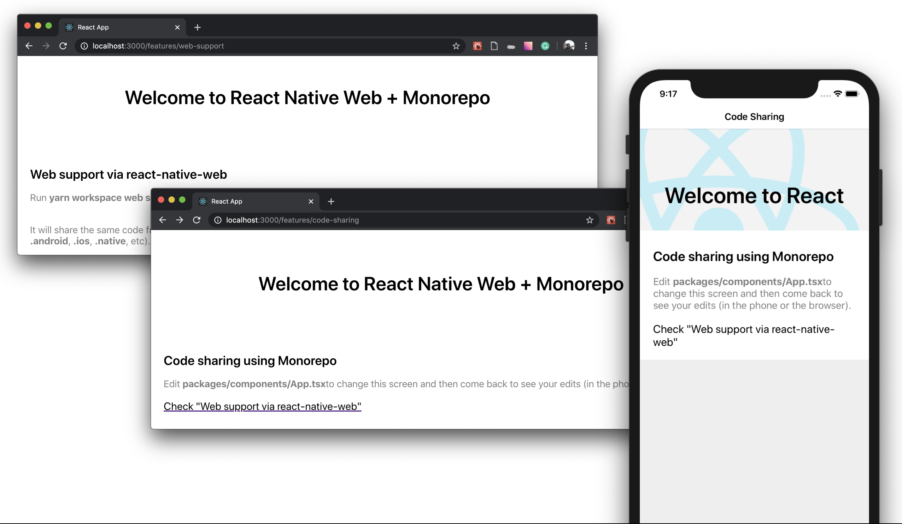

# Navigation on React Native [Web]

This is the source code from [this blog post](https://dev.to/ythecombinator/driving-towards-a-universal-navigation-strategy-in-react-j60).

### Table of Contents

- [How to run](#how-to-run)
- [API](#api)
- [Roadmap](#roadmap)

### How to run

_Requirements: [React Native](https://facebook.github.io/react-native/docs/getting-started.html#native) (last tested on react-native@0.61)_

- `$ git clone git@github.com:ythecombinator/react-native-web-monorepo-navigation.git`
- `$ cd react-native-web-monorepo-navigation`
- `$ yarn`
- `$ cd packages/mobile/ios`
- `$ pod install`
- `$ cd -`
- `$ yarn workspace web start`
- `$ yarn workspace mobile start`
- Run the project
  - [iOS] Via Xcode
    - `yarn xcode` (open the project on Xcode)
    - Press the Run button
  - [Android] Via Android Studio
    - `yarn studio` (open the project on Android Studio)
    - Press the Run button
  - Via CLI
    - _You may need to launch your device emulator before the next command_
    - `$ yarn android` or `$ yarn ios`

### [API](#api)

#### `useNavigation()`

`useNavigation` is a hook which gives access to the `navigation` object. It includes:

- `navigate`: Go to another route
- `replace`: Replace the current route with a new one
- `goBack`: Close active route and move back in the stack

#### `useRoute()`

`useRoute` is a hook which gives access to the `route` object. It includes:

- `name`: Name of the route. Defined in navigator component hierarchy
- `params`: Set of params which is defined while navigating – e.g. `navigate('Twitter', { user: 'Dan Abramov' })`

#### `<Link />`

Provides declarative, accessible navigation around your application. It has the following props:

- `path`: A string representing the path to link to
- `params`: An object of key/value pairs of route parameters

### Roadmap

#### API

- [x] `useRoute` hook
- [x] `useNavigation` hook
- [x] `Link` componentt
- [ ] `Redirect` component

#### Miscellaneous

- [ ] Move API to a library that can be installed as an npm package
